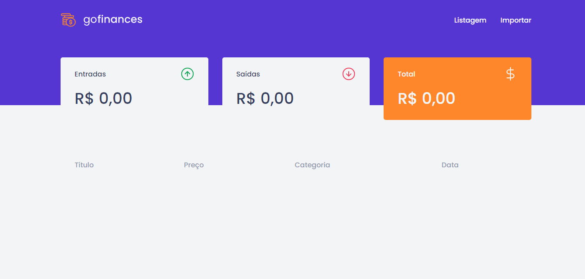

<div align="center">
  
</div>

<div>
  
</div>

## 📋 Sobre

A aplicação goFinances controla as finanças pessoais, diferenciando asentradas e saídas onde em verde representa as entradas e vermelho são as saídas, foi criada no bootcamp GoStack como desafio 07 para praticar e fixar os conceitos em processamento de arquivos .csv e apronfundar ainda mais em **ReactJS** e consumo de API, está foi crianda anteriormente no cumprimento do desafio 06. [Github](https://api.github.com)


## 🚀 Tecnologias Utilizadas

Foi desenvolvida usando as seguintes tecnologias:

### Front-end:

- [ReactJS](https://pt-br.reactjs.org)
- [Axios](https://github.com/axios/axios)
- [Styled-components](https://styled-components.com)
- [Filesize](https://www.npmjs.com/package/filesize)
- [TypeScript](https://www.typescriptlang.org)

### Back-end:

- [NodeJS](https://nodejs.org/en)
- [Express](https://expressjs.com)
- [Multer](https://www.npmjs.com/package/multer)
- [TypeORM](https://typeorm.io/#/)
- [PostgreSQL](https://www.postgresql.org/)
- [Docker](https://www.docker.com/)
- [CSV-Parse](https://www.npmjs.com/package/csv-parse)


## 📦 Como Baixar e Executar o Projeto Front-end

```bash

  # Para clonar o repositório para sua maquina

  $ git clone https://github.com/eloilsonrocha/Desafio07FundamentosReactGoFinances.git


  # Entrar na pasta do projeto

  $ cd Desafio07FundamentosReactGoFinances


  # Para instalar todas as dependências do projeto

  $ yarn


  # Para iniciar a aplicação na porta: 3000

  $ yarn start

```


## 📦 Como Baixar e Executar o Projeto Back-end

```bash

  # Para clonar o repositório para sua maquina

  $ git clone https://github.com/eloilsonrocha/Desafio06DatabaseUpload.git


  # Entrar na pasta do projeto

  $ cd Desafio06DatabaseUpload


  # Para instalar todas as dependências do projeto

  $ yarn


  # Para iniciar a aplicação na porta: 3333

  $ yarn start

  ```

## 🚦 Importante:

Esse projeto está configurado com as credenciais para o Banco de Dados PostgreSQL, acesse o arquivo ormconfig.json dentro da pasta Desafio07FundamentosReactGoFinances para consultar ou alterar as crendenciais de acesso.
Leia as documentações oficiais em [Back-end](#-Back-end), para conseguir instalar e configurar o banco.

## Licença:

MIT License

Desenvolvido por Eloilson Rocha
